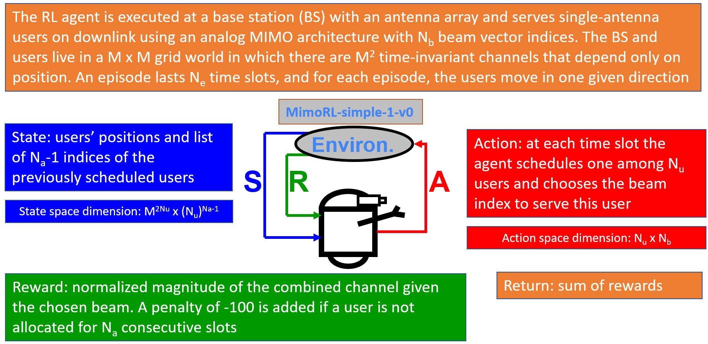

# Installation of MimoRL-simple-1-v0 environment and DQN code

Besides the dependencies described for the Jupyter notebooks of this tutorial, in order to run the RL code you will need 
[Stable-Baselines](https://stable-baselines.readthedocs.io/en/master/) (we used stable-baselines version 2.10.2), OpenAI gym (we used gym==0.18.0), pygame (we used pygame==2.0.1) and bidict (we used bidict==0.21.2). We also recommend Python version 3.7, since Tensorflow 1.X is not available for Python versions above 3.7. 

You can install dependencies, for instance, with:

```
pip install -r ./requirements.txt
```

# Main scripts

To train a deep Q-network (DQN), use:
```
python train_dqn_agent.py
```

In order to observe the training evolution, you may want to open an exclusive console and run:
```
tensorboard --logdir=.\log_tensorboard
```
After tensorboard finishes its initialization, you can copy the URL that tensorboard will inform and open it in your browser.

To investigate the MimoRL-simple-1-v0 environment:
```
python env_mimo_rl_simple.py
```

# Information about the environment

The RL agent is executed at a base station (BS) with an antenna array and serves single-antenna users on downlink using an analog MIMO architecture with Nb beam vector indices. The BS and users live in a M x M grid world in which there are M2 invariant channels depending only on position. An episode lasts Ne time slots, and for each episode, a user moves left/right/up/down. It is an episodic (not continuing) task. The reward is a normalized throughput (in fact, thee magnitude of the combined channel) and a penalyy of -100 is added if a user is not allocated for Na=3 consecutive slots.


